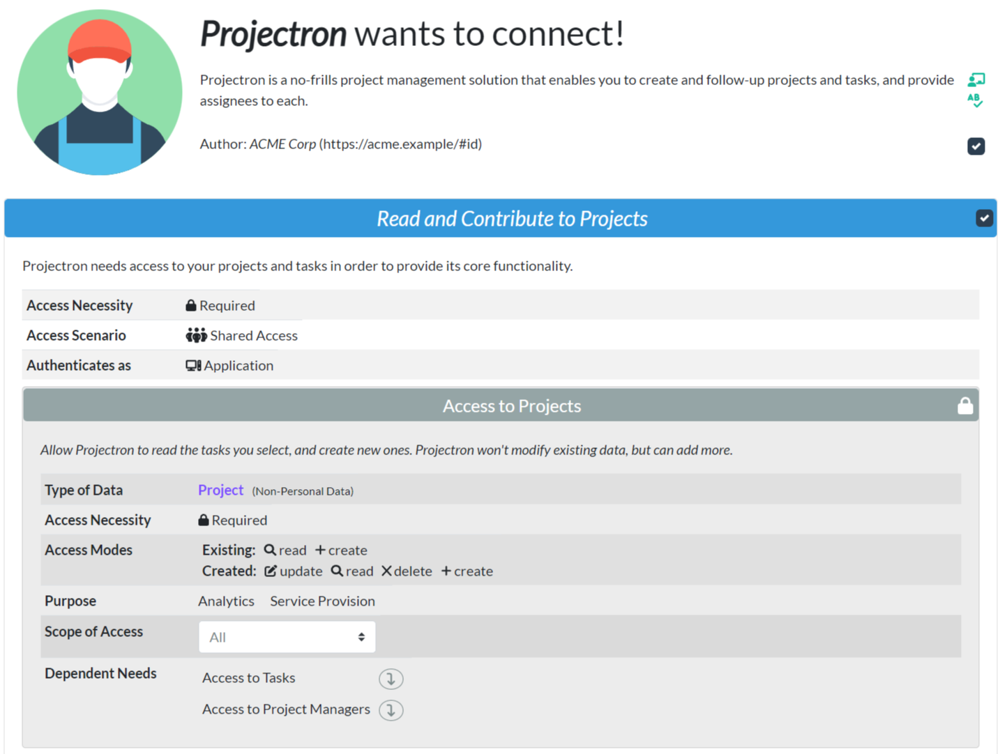

# Solid Application Access Request & Authorization UI
A user interface for reviewing external application access requirements to one's [Solid](https://solidproject.org) POD (Personal Online Datastore), based on the [Resource Description Framework (RDF)](https://www.w3.org/TR/PR-rdf-syntax/Overview.html), [Data Interoperability Panel (INTEROP) specification](https://solid.github.io/data-interoperability-panel/specification/) and the [Data Privacy Vocabulary (DPV)](https://w3c.github.io/dpv/dpv-owl/) ontology.

## Use Case
The user interface was designed to address the following use case:

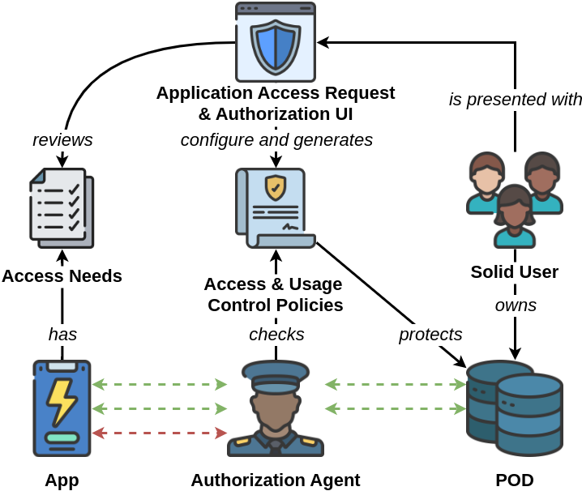

* Solid users own personal data in their Solid POD, and use applications.
* These applications require access to the users' data in order to operate.
* Users should be able to see what these applications needs to access, how and to do what.
* Based on this, users should be able to grant/deny access to new applications that they choose to use.
* Users should also be able to restrict the use made by authorized applications to only purposes that they have agreed to (a requirement coming from the EU GDPR).

→ Everyting needs to be operable on a machine level.

The user interface thus relies on the INTEROP specification for the authorization workflow and enforcement, the DPV for specifying the authorized purposes, and RDF to model and transfer data.

## Design
The user interface presented in this paper is based on the following model.

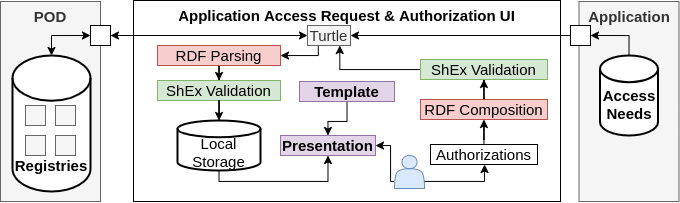

It accepts as input a collection of access needs from an application, as well as information about the content of the user's POD (organised in _registries_), as specified in the INTEROP specification.

The input is fed into a template and presented to the user for review.  
The user can either:
* agree to the sharing of their data, and configure the extact extent of the authorization to grant  
or
* refuse to grant access altogether.

If the user agrees to the sharing, then a set of correspondin authorization is produced and returned to the user POD for enforcement.

### Paper
Our paper "**Application Access Request and Authorization User Interface** - _Enabling End-Users to Share and Protect Their Data in the Solid Architecture_" is currently being reviewed by the Dublin City University M. Sc. Practicum Examiners and Progression and Awards Board.

It explored three versions of an application access request emanating from INTEROP's Projectron:
|V1|V2|V3|
|--|--|--|
|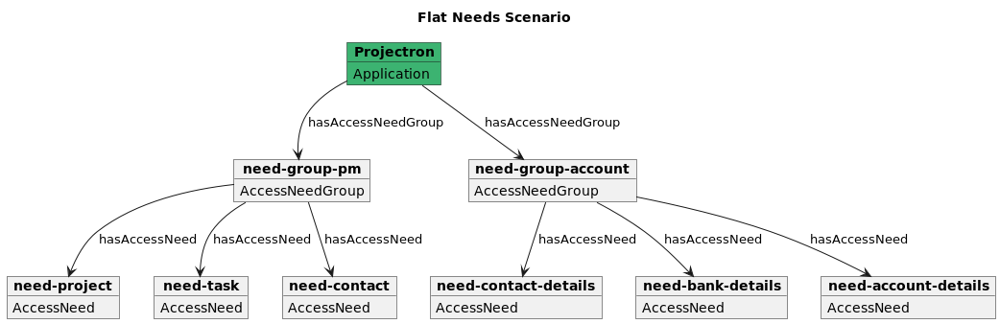|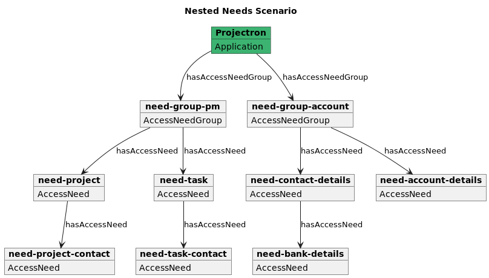|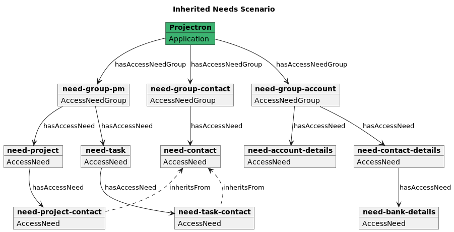|

It included revisions to the original INTEROP specification, in order to ease the traversing of graphs, enforce the presence of human-friendly labels and descriptions, and to include the DPV ontology to specify intended and authorized data processing purposes. In addition, it proposed changes to some scopes of access.

|Model|Original Specification|Revised Specification|
|-|-|-|
|**Application**|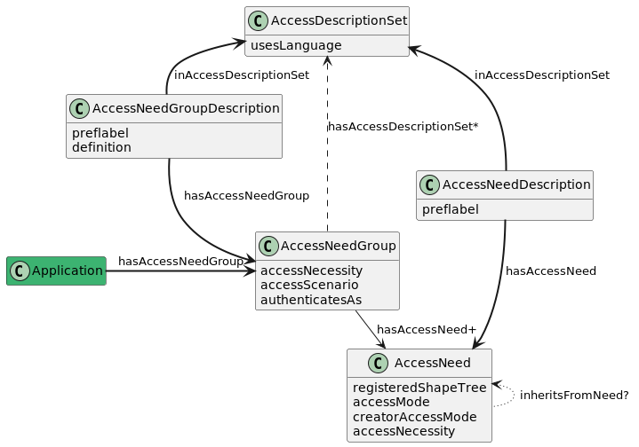|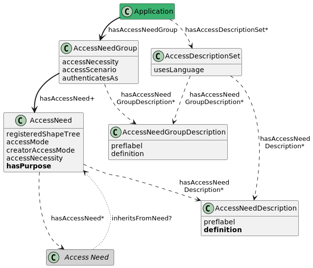|
|**Scope of Accesses**|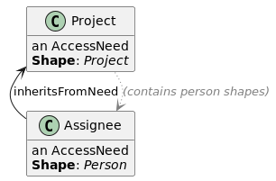|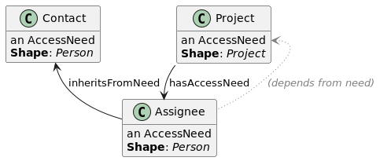|

## Implementation
The user interface prototype is a Vue.js web application with a Java Springboot backend.

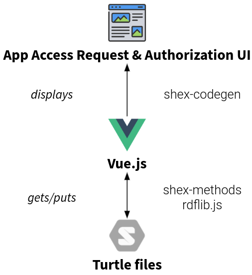

It makes use of the following three libraries to manipulate data in RDF turtle file format.
* [shex-codegen](https://github.com/ludwigschubi/shex-codegen/)
* [shex-methods](https://github.com/ludwigschubi/shex-methods/)
* [rdflib](https://github.com/linkeddata/rdflib.js)

<table>
  <tr>
    <th>#</th><th>Caveat</th>
    </tr>
    <tr>
    <td>1</td>
    <td>This project was realised for a M.Sc. in Computing Master thesis, without previous experience in the field of Vue.js, typescript or the Solid ecosystem. As a result, the project may not satisfy the best practices in terms of Typescript development or testing.</td>
    </tr>
    <tr>
    <td>2</td>
    <td>Due to specification issues, this project currently uses custom versions of these libraries. This was necessary since the issues are currently investigated/on hold.
    <ul>
    <li> <a href="https://github.com/ludwigschubi/shex-codegen/pull/139">github.com/ludwigschubi/shex-codegen/pull/139</a></li>
    <li> <a href="https://github.com/ludwigschubi/shex-codegen/pull/140">github.com/ludwigschubi/shex-codegen/pull/140</a></li>
    <li> <a href="https://github.com/linkeddata/rdflib.js/pull/557">github.com/linkeddata/rdflib.js/pull/557</a></li>
    </ul>
    </td>
    </tr>
    <tr>
    <td>3</td>
    <td>This project does not load data from their actual origin, but instead are retrieved artificially. This is because of CORS issues and impossibily to recreate the scenario in reality. In addition, this was not the core interest in this project.</td>
    </tr>
    <tr>
    <td>4</td>
    <td>The current retrieval of data is checked against ShEx methods, which is properly operated... but not well handled when it detects an invalid shape instance (resulting in empty promises).</td>
    </tr>
</table>

### Run locally
To run the application locally, the following actions need to be performed:
* The back-end URL should be updated in [rdf.io.ts](https://github.com/HBailly/solid-auth-ui/blob/main/src/main/webapp/app/shared/rdf/rdf.io.ts)
* Then, simply start the executable `mvnw`.

Optionally, using `npm start`, you can start a hot-reload version of the front-end application.

# License
Distributed under the GNU GPL v3 License. See `LICENSE` for more information.

# Contact
Hadrien Bailly - @h_bailly - [LinkedIn](https://www.linkedin.com/in/baillyhadrien/) - H.Bailly@live.be

Project Link: https://github.com/HBailly/solid-auth-ui

# Remarks

<table>
  <tr>
    <th>Credits</th>
    <td>Icons: <a href="https://www.flaticon.com/authors/juicy-fish/">juicy_fish</a></td>
    </tr>
</table>
